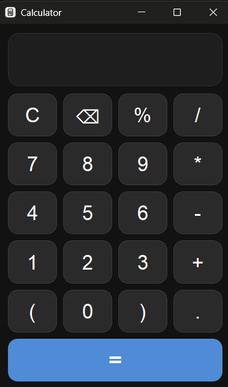
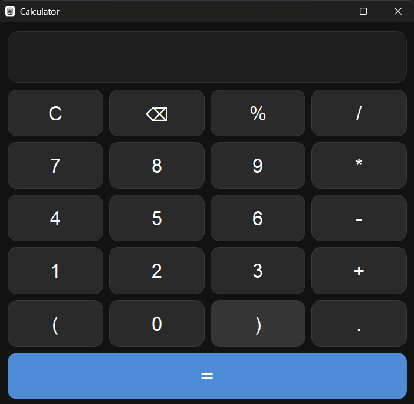

# Calculator App

A modern desktop calculator built using **Python** and **PyQt5**. It features a responsive dark-themed interface, keyboard and mouse support, and safe expression evaluation without using Python's `eval()`.

## Features

* Dark theme UI
* Native Windows dark title bar support
* Responsive and resizable layout
* Mouse input support
* Keyboard input support
* Basic arithmetic operations

  * Addition (`+`)
  * Subtraction (`-`)
  * Multiplication (`×`)
  * Division (`÷`)
* Percentage calculations
* Parentheses support
* Decimal number support
* Backspace (`⌫`) functionality
* Clear (`C`) functionality
* Safe expression evaluation using Python's `ast` module
* Custom application icon support
* Windows Snap compatibility

---

## Screenshots

### Main Interface



### Resized Window


---

## Project Structure

```text
Calculator-App/
│
├── dist/main.exe
├── main.py
├── calculator.ico
├── requirements.txt
├── README.md
├── screenshots/
│   ├── main.png
│   └── resized.png
└── .gitignore
```

---

## Requirements

* Python 3.8 or higher
* PyQt5

---

## Installation

### Clone the repository

```bash
git clone https://github.com/your-username/Calculator-App.git
cd Calculator-App
```

### Create a virtual environment (Optional)

#### Windows

```bash
python -m venv venv
venv\Scripts\activate
```

#### Linux/macOS

```bash
python3 -m venv venv
source venv/bin/activate
```

### Install dependencies

```bash
pip install -r requirements.txt
```

---

## Running the Application

```bash
python main.py
```

---

## Keyboard Shortcuts

| Key         | Action                |
| ----------- | --------------------- |
| `0 - 9`     | Enter numbers         |
| `+ - * /`   | Arithmetic operators  |
| `.`         | Decimal point         |
| `%`         | Percentage            |
| `(` `)`     | Parentheses           |
| `Enter`     | Calculate             |
| `Backspace` | Delete last character |
| `Esc`       | Clear display         |

---

## Creating an Executable

Install PyInstaller:

```bash
pip install pyinstaller
```

Build the executable:

```bash
pyinstaller --onefile --windowed --icon=calculator.ico main.py
```

The generated executable will be available in the `dist` folder.

---

## Technologies Used

* Python
* PyQt5
* AST (Abstract Syntax Tree)

---

## Future Improvements

* Scientific calculator mode
* Calculation history
* Memory functions (M+, M−, MR, MC)
* Copy and paste support
* Theme customization

---

## License

This project is licensed under the MIT License.
